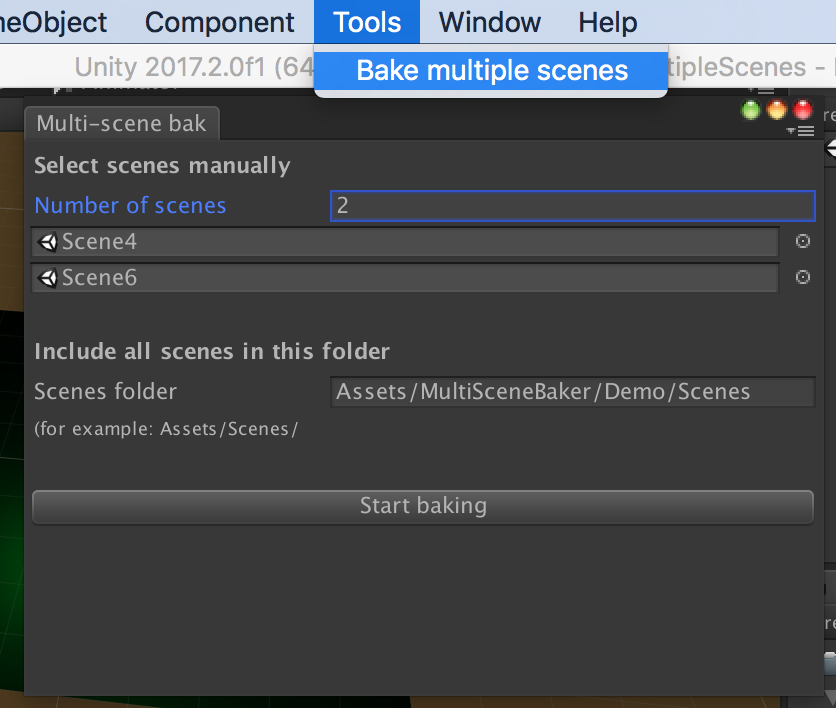

# unity-multiscene-lightmap-baker
Allows you to automate the process of baking lights when you have multiple independent scenes.

To use, import the latest .unitypackage, or add the script BakeAllScenesWindow.cs in your Editor folder.

Select Tools/Bake multiple scenes, and there you can drag Scene Assets, or select a folder with multiple scenes:

